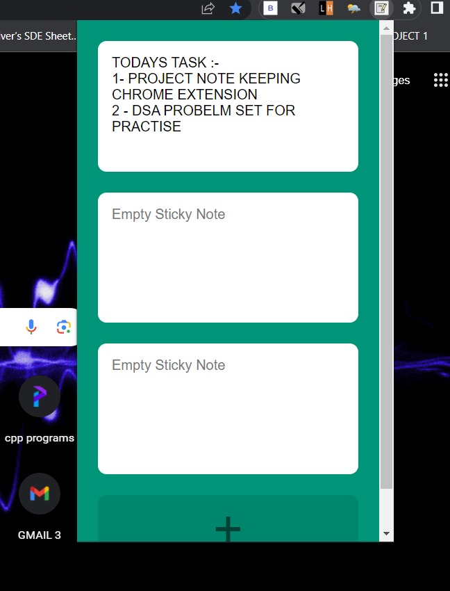
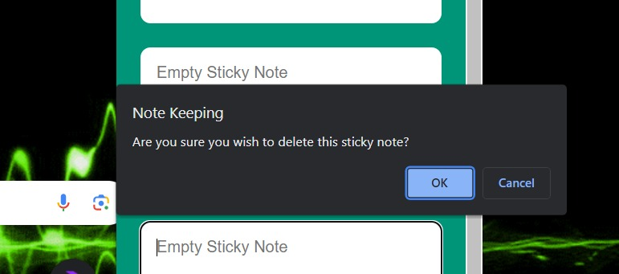

# Note-Keeping-Chrome-Extension

This is Note Keeping Application which allows the user to keep up their Day-to-Day tasks and Notes. 
This uses local storage so if we close the browser or reload the browser it will remain as it is.
 
 
# Outlook  
The Crome Extension looks like -  
 
 
This is The Basic Outlook of the Extension  
 
Here -  
1 - We Can add sections/Notes to enter. 
2 - We can update them anytime according to our use.
 
 
 
 
 
3 - Perform Deletion by double clicking on the textarea whenever needed.
 
 
 manifest.json file contains the structural code that is used to load the extension in the browser .
  
  
 # Steps -  
  
 1 - Download the complete code as zip file and extract the code. 
 2 - Now Open your Browser , and go to manage extensions. 
 3 - Now enable Developer Mode , you will see three options load unpacked , packed extensions , update . 
 4 - Click on Load Unpacked and select the folder Downloaded. 
 5 - Chrome Extension Added fo your use.  
